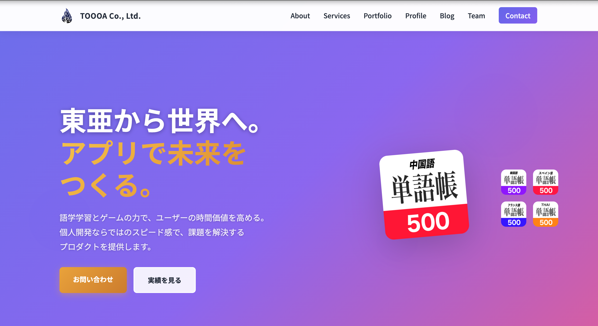

# TOOOA Co., Ltd. 公式ウェブサイト



## 🌐 サイトURL
**https://oto0928.github.io/Homepage/**

## 📖 概要

TOOOA Co., Ltd.（株式会社TOOOA）の公式ウェブサイトです。東亜から世界へ、アプリで未来をつくることをミッションに、モバイルアプリ開発とWebサイト制作を行っています。

## ✨ 主な機能

### 🏠 トップページ（index.html）
- **ヒーローセクション**: 企業のビジョンとミッションを表示
- **サービス紹介**: モバイルアプリ開発、Webサイト制作、技術コンサルティング
- **実績・作品**: 9つのアプリと4つのWebサイトをスライダー形式で展示
- **チーム紹介**: 代表の紹介
- **お問い合わせフォーム**: メールでの問い合わせ機能

### 💼 ポートフォリオページ（portfolio.html）
- **アプリ開発実績**: 
  - 中国語単語帳500
  - 韓国語単語帳500
  - スペイン語単語帳500
  - フランス語単語帳
  - タイ語単語帳500
  - ドイツ語単語帳500
  - アラビア語単語帳500
  - オフラインゲーム集
  - SpeedCamera（無音カメラ）
  - TomYumKitchen（飲食店アプリ）
- **Webサイト制作実績**:
  - TOOOA公式サイト
  - Discover East Timor（東ティモール観光ガイド）
  - プロフィールサイト
  - ブログサイト
- **技術スタック**: Swift, SwiftUI, Firebase, HTML/CSS/JavaScript等

### 👤 プロフィールページ（profile.html）
- **代表プロフィール**: 竹内 音碧（Takeuchi Oto）
- **経歴・経験**: 
  - 株式会社プロパゲート 長期インターン（2025年9月〜）
  - 東ティモール海外ボランティア（2025年10月）
  - タイ短期留学（2024年8月）
- **スキル**: Swift, SwiftUI, Firebase, HTML, CSS, JavaScript等
- **実績統計**: 10リリースアプリ、500+累計ダウンロード

### 📝 ブログページ（blog/blog.html）
- **技術記事**: アプリ開発のノウハウと経験談
- **記事一覧**:
  - タイ留学で学んだアプリ開発とローカライゼーション
  - 弾丸富士山タイムアタック！
  - 私の資格取得体験
  - 個人開発でiOSアプリを7つリリースした経験談
- **カテゴリフィルター**: 開発、デザイン、ビジネス、ゲーム開発等
- **検索機能**: キーワード検索対応

## 🛠️ 技術スタック

### フロントエンド
- **HTML5**: セマンティックなマークアップ
- **CSS3**: 
  - カスタムプロパティ（CSS変数）
  - Flexbox / Grid レイアウト
  - レスポンシブデザイン（モバイルファースト）
  - アニメーション（@keyframes）
- **JavaScript（Vanilla JS）**:
  - DOM操作
  - Intersection Observer API（スクロールアニメーション）
  - スライダー機能
  - フォームバリデーション
  - ハンバーガーメニュー

### デザイン
- **カラースキーム**: 
  - プライマリー: `#2563eb`（青）
  - セカンダリー: `#10b981`（緑）
  - アクセント: `#f59e0b`（オレンジ）
- **タイポグラフィ**: Noto Sans JP, Inter
- **アイコン**: Font Awesome 6.4.0

### レスポンシブ対応
- **ブレークポイント**:
  - デスクトップ: 1024px以上
  - タブレット: 768px〜1024px
  - モバイル: 480px〜768px
  - 小画面: 480px以下

## 📁 プロジェクト構造

```
TOOOA-homepage/
├── index.html              # トップページ
├── portfolio.html          # ポートフォリオページ
├── profile.html            # プロフィールページ
├── styles.css              # グローバルスタイル
├── script.js               # グローバルスクリプト
├── portfolio.css           # ポートフォリオ専用スタイル
├── portfolio.js            # ポートフォリオ専用スクリプト
├── profile.css             # プロフィール専用スタイル
├── profile.js              # プロフィール専用スクリプト
├── blog/                   # ブログ関連ファイル
│   ├── blog.html           # ブログトップページ
│   ├── blog-page.css       # ブログページスタイル
│   ├── blog-page.js        # ブログページスクリプト
│   ├── blog-article-*.html # 各記事ページ
│   ├── blog-article-*.css  # 各記事スタイル
│   └── blog-article.js     # 記事共通スクリプト
├── img/                    # 画像ファイル
│   ├── TOOOA.png           # ロゴ
│   ├── fabikon.png         # ファビコン
│   ├── appaikon.*.jpg      # アプリアイコン
│   └── blog.*.jpeg         # ブログ画像
└── README.md               # このファイル
```

## 🎨 デザイン原則

### レスポンシブデザイン
- モバイルファーストアプローチ
- 流動レイアウト（固定幅を避ける）
- タップ領域は最小44×44px
- 画像は`max-width: 100%`で可変対応

### アクセシビリティ
- セマンティックHTML
- キーボードナビゲーション対応
- フォーカス可視化
- 適切なコントラスト比

### パフォーマンス
- 画像の最適化
- CSS/JSの最小化
- 遅延読み込み（Intersection Observer）
- スムーズスクロール

## 🚀 主な機能

### スライダー機能
- 実績・作品セクションで使用
- レスポンシブ対応（画面サイズに応じて表示数変更）
- ドットナビゲーション
- 自動スライド（ホバーで停止）
- 左右ボタンでの手動操作

### スクロールアニメーション
- Intersection Observer APIを使用
- 要素が画面に入ったときにフェードイン
- パフォーマンスに配慮した実装

### お問い合わせフォーム
- フロントエンドバリデーション
- 必須項目チェック
- メールアドレス形式検証
- `mailto:`プロトコルでメール送信

### ハンバーガーメニュー
- モバイル表示時に自動切替
- スムーズなアニメーション
- 背景クリックで閉じる

## 📊 実績

- **リリースアプリ数**: 10個
- **累計ダウンロード数**: 500+
- **Webサイト制作**: 4サイト
- **ブログ記事**: 4記事以上

## 🌏 多言語対応アプリ

- 中国語、韓国語、スペイン語、フランス語、タイ語、ドイツ語、アラビア語など、多言語対応の単語帳アプリを開発
- ローカライゼーションとグローバル展開の経験

## 📱 対応ブラウザ

- Chrome（最新版）
- Firefox（最新版）
- Safari（最新版）
- Edge（最新版）
- モバイルブラウザ（iOS Safari, Chrome Mobile）

## 📞 お問い合わせ

- **Email**: toa0928koron@icloud.com
- **Website**: https://oto0928.github.io/Homepage/
- **Instagram**: [@toooa.co.ltd](https://www.instagram.com/toooa.co.ltd/)
- **LINE**: [@toooa](https://line.me/R/ti/p/@toooa)

## 📄 ライセンス

© 2025 TOOOA Co., Ltd. All rights reserved.

---

**東亜から世界へ。アプリで未来をつくる。**

